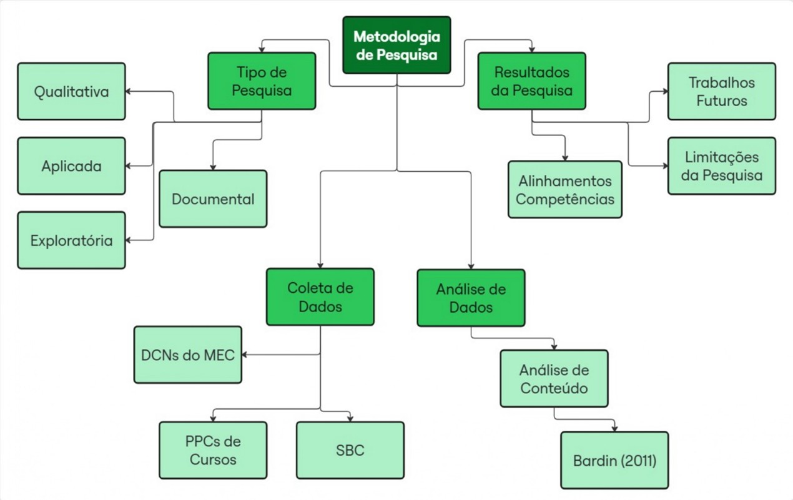
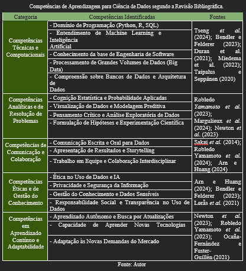
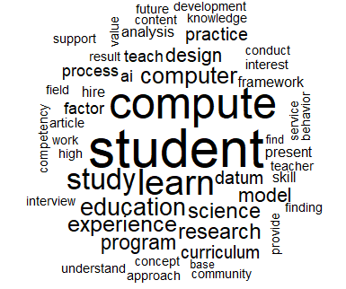
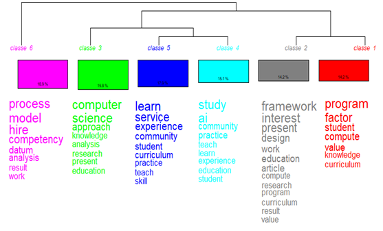

# 📊 Competências em Ciência de Dados: A Representação do Conhecimento dos Cursos Superiores no Brasil

Repositório com breve explanação da pesquisa, além de dados, imagens e materiais complementares utilizados na dissertação de mestrado desenvolvida no **Programa de Pós-Graduação em Gestão do Conhecimento nas Organizações (PPGGCO) da UNICESUMAR**.

---

## 👨‍🎓 Autor
- **Augusto Agostini Tonelli**  
  Programa de Pós-Graduação em Gestão do Conhecimento nas Organizações – UNICESUMAR  
  Orientador: Prof. Dr. Nelson Tenório  

---

## 🎯 Objetivo Geral
Representar o conhecimento referente as competências necessárias para a formação superior em Ciência de Dados conforme a determinação dos órgãos governamentais, a sugestão da sociedade civil organizada e as propostas de instituições de ensino superior, com base em quatro grandes fontes:
- **Diretrizes Curriculares do MEC** (Computação, Matemática, Estatística);
- **Sugestões da Sociedade Brasileira de Computação (SBC)**;
- **Projetos Pedagógicos de Cursos (PPCs)** das IES brasileiras;
- **Revisão Sistemática da Literatura Acadêmica**.

---

## 🧩 Objetivos Específicos
- Examinar as competências para cursos de Ciência de Dados mencionadas na literatura.  
- Analisar as competências apresentadas nas diretrizes curriculares determinadas por órgãos governamentais.  
- Identificar as competências sugeridas pela sociedade civil organizada em computação no Brasil.  
- Coletar as propostas das instituições de ensino superior disponíveis em documentos públicos na internet.  
- Representar o conhecimento para o objeto de estudo.  
- Discutir o conhecimento representado sob a perspectiva da GC.  

---

## ⚙️ Metodologia



A pesquisa é **aplicada, qualitativa, exploratória e documental**, estruturada em três etapas principais:

1. **Busca nas bases científicas**  
   - Bases utilizadas: ACM Digital Library e IEEEXplore.  
   - String de busca utilizada:  
     ```
     :‘Learning’ AND (‘Competence’ OR ‘Skill OR, ‘Expertise’) AND 'Data Science')
     ```
   - Critérios de inclusão: Periódicos da área educacional; Artigos completos; Publicações entre 01/01/2020 e 31/07/2024.  

2. **Análise documental**  
   - Diretrizes do MEC para Computação, Matemática e Estatística.  
   - Recomendações da SBC (modelo de eixos de competências).  
   - PPCs das IES brasileiras coletados via sites oficiais.  

3. **Revisão e análise de conteúdo**  
   - Mapeamento das competências encontradas na literatura.  
   - Comparação com MEC, SBC e PPCs.  
   - Identificação de alinhamentos e desalinhamentos.  

---

### 📌 Competências encontradas na literatura
A análise sistemática da literatura possibilitou o levantamento das principais competências associadas à formação em Ciência de Dados. Observou-se a predominância de habilidades técnicas ligadas à estatística, matemática e programação, acompanhadas de competências transversais como comunicação, ética e aprendizagem contínua.



---

### 📌 Nuvem de palavras
A nuvem de palavras revelou a predominância dos termos student, compute, study e learn, indicando a centralidade do estudante e do aprendizado em computação. Em seguida, destacam-se education, experience, program e research, reforçando a ligação entre prática acadêmica e profissional. Além disso, palavras como design, practice, science e curriculum apontam para a importância dos currículos e modelos pedagógicos na formação em Ciência de Dados.



---

### 📌 Dendrograma
O dendrograma agrupou as competências em seis classes principais. A primeira reúne termos como program, factor e compute, reforçando a base técnica da área. Outras classes se voltam para a formação acadêmica com destaque para student, education, curriculum e experience, além da ênfase em learn e study, ligados ao processo de aprendizagem. Também aparecem agrupamentos voltados a computer science, analysis e research, e a aspectos de process, model e competency, evidenciando a integração entre técnica, ensino e prática. Esses grupos revelam como as competências se inter-relacionam, equilibrando dimensões técnicas, pedagógicas e de aplicação prática.



---

## 📑 Documentos

📄 **[dissertacao.pdf](./dissertacao.pdf)** – Arquivo completo da dissertação.  

## 📚 Competências (MEC & SBC)

Documentos-base utilizados para extrair e comparar competências dos cursos:

- **MEC – Diretrizes dos cursos de Computação**  
  [Visualizar](./documentos/competencias/competencias_computacao.pdf)

- **MEC – Diretrizes do curso de Estatística**  
  [Visualizar](./documentos/competencias/competencias_estatistica.pdf)

- **MEC – Diretrizes do curso de Matemática**  
  [Visualizar](./documentos/competencias/competencias_matematica.pdf)

- **SBC (Sociedade Brasileira de Computação) - Sugestões para o Bacharelado em Ciência de Dados
  [Visualizar](./documentos/competencias/competencias_sbc.pdf)

## 🔗 **Cursos analisados (origem das competências dos PPCs e IES)**  

- [UFPB – Ciência de Dados e Inteligência Artificial](https://sigaa.ufpb.br/sigaa/public/curso/portal.jsf?id=14289031&lc=pt_BR)  
- [FATEC Ourinhos – Ciência de Dados](https://www.fatecourinhos.edu.br/cursos/ciencia/)  
- [FATEC Santana de Parnaíba – Ciência de Dados](https://fatecsdp.cps.sp.gov.br/ciencia-de-dados/)  
- [FATEC Adamantina – Ciência de Dados](https://www.fatec.edu.br/adamantina/ciencia-de-dados/)  
- [FATEC Cotia – Ciência de Dados](https://fateccotia.cps.sp.gov.br/ciencia-de-dados/)  
- [UNIVESP – Bacharelado em Ciência de Dados (EAD)](https://univesp.br/cursos/bacharel-em-ciencia-de-dados)  
- [UFPB – Ciência de Dados para Negócios](https://sigaa.ufpb.br/sigaa/public/curso/portal.jsf?id=19420831&lc=pt_BR)  
- [USP – Bacharelado em Ciência de Dados](https://icmc.usp.br/graduacao/ciencia-de-dados-bacharelado)  
- [USP – Estatística e Ciência de Dados](https://www.icmc.usp.br/graduacao/estatistica-bacharelado)  
- [Universidade Anhembi Morumbi – Ciência de Dados (Bacharelado)](https://portal.anhembi.br/cursos/graduacao/ciencia-de-dados-bacharelado/)  

---

## 📊 Resultados Principais

Na pesquisa, a representação do conhecimento foi entendida como a organização explícita e estruturada das competências em Ciência de Dados e suas relações (entre literatura, MEC, SBC e PPCs), para tornar visíveis convergências e lacunas. Operacionalmente, isso se materializou em: (i) extração e categorização das competências de cada fonte; (ii) mapeamento cruzado em matrizes de alinhamento/desalinhamento; e (iii) apoio de ferramentas de GC (ontologias/quadros, análise de lacunas, benchmarking e BSC) para sistematizar o vocabulário e comparar o que é esperado vs. ofertado. Com isso, a representação funcionou como um “modelo de referência” para leitura dos resultados e priorização de ajustes curriculares. 

Os resultados mostram um núcleo técnico comum: estatística/probabilidade, matemática aplicada, programação, modelagem e análise de dados, com visualização/comunicação técnica aparecendo como ponte entre técnica e tomada de decisão. A SBC enfatiza eixos integradores (fundamentos, resolução de problemas, prática/aplicação), enquanto as diretrizes MEC correlatas (Computação, Matemática, Estatística) reforçam bases formais e capacidades analíticas. A literatura converge nesse núcleo duro e amplia o escopo para ética/privacidade, trabalho colaborativo, pensamento crítico e aprendizagem contínua, apontando a importância de competências transversais para o perfil profissional. 

Ao projetar esse núcleo sobre os PPCs analisados, observou-se alinhamento consistente nas bases técnicas (estatística, programação, manipulação/qualidade de dados e, com menor frequência, modelagem/ML), além de conteúdos de visualização. Entretanto, a comparação evidenciou desalinhamentos em dimensões transversais: ética e governança de dados, comunicação para públicos não técnicos, gestão de projetos, trabalho em equipe e aprendizagem ao longo da vida aparecem de forma irregular ou pouco operacionalizadas como resultados de aprendizagem mensuráveis. Esse descompasso ajuda a explicar a heterogeneidade formativa entre IES, especialmente em contextos com forte expansão via EAD. 

Em síntese, os dados indicam que o Brasil já consolidou um padrão mínimo técnico para formação em Ciência de Dados, mas ainda carece de padronização e evidências de domínio nas competências transversais que a literatura e a SBC consideram críticas. A representação do conhecimento proposta pela pesquisa mostrou-se útil para tornar explícitos alinhamentos e priorizar lacunas (ética, comunicação, aprendizagem contínua), oferecendo um guia prático para evolução curricular dos PPCs e maior aderência entre expectativas acadêmicas, diretrizes regulatórias e demandas do mercado.

---

## 🛠 Ferramentas Utilizadas
- **Excel**: para tratamento das bases do MEC.  
- **Iramuteq**: geração de dendrograma e nuvem de palavras.  
- **Overleaf (LaTeX)**: organização da dissertação.  
- **GitHub**: disponibilização dos dados para consulta pública.

---

