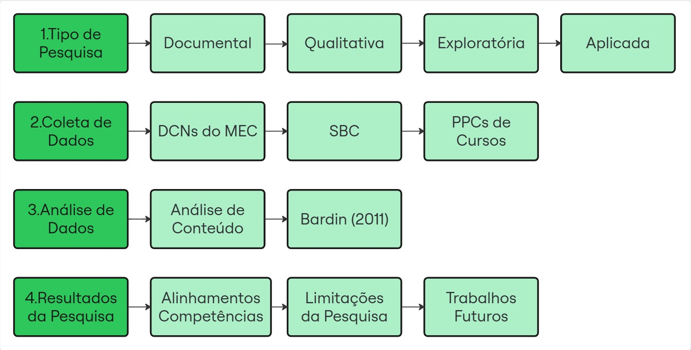

# 📊 Competências em Ciência de Dados: A Representação do Conhecimento dos Cursos Superiores no Brasil

Repositório com os dados, imagens e materiais complementares utilizados na dissertação de mestrado desenvolvida no **Programa de Pós-Graduação em Gestão do Conhecimento nas Organizações (PPGGCO) da UNICESUMAR**.

---

## 👨‍🎓 Autor
- **Augusto Agostini Tonelli**  
  Programa de Pós-Graduação em Gestão do Conhecimento nas Organizações – UNICESUMAR  
  Orientador: Prof. Dr. Nelson Tenório  

---

## 🎯 Objetivo Geral
Representar o conhecimento referente as competências necessárias para a formação superior em Ciência de Dados conforme a determinação dos órgãos governamentais, a sugestão da sociedade civil organizada e as propostas de instituições de ensino superior, com base em quatro grandes fontes:
- **Diretrizes Curriculares do MEC** (Computação, Matemática, Estatística);
- **Sugestões da Sociedade Brasileira de Computação (SBC)**;
- **Projetos Pedagógicos de Cursos (PPCs)** das IES brasileiras;
- **Revisão Sistemática da Literatura Acadêmica**.

---

## 🧩 Objetivos Específicos
- Examinar as competências para cursos de Ciência de Dados mencionadas na literatura.  
- Analisar as competências apresentadas nas diretrizes curriculares determinadas por órgãos governamentais.  
- Identificar as competências sugeridas pela sociedade civil organizada em computação no Brasil.  
- Coletar as propostas das instituições de ensino superior disponíveis em documentos públicos na internet.  
- Representar o conhecimento para o objeto de estudo.  
- Discutir o conhecimento representado sob a perspectiva da GC.  

---

## ⚙️ Metodologia



A pesquisa é **aplicada, qualitativa, exploratória e documental**, estruturada em três etapas principais:

1. **Busca nas bases científicas**  
   - Bases utilizadas: ACM Digital Library e IEEEXplore.  
   - String de busca utilizada:  
     ```
     :‘Learning’ AND (‘Competence’ OR ‘Skill OR, ‘Expertise’) AND 'Data Science')
     ```
   - Critérios de inclusão: Periódicos da área educacional; Artigos completos; Publicações entre 01/01/2020 e 31/07/2024.  

2. **Análise documental**  
   - Diretrizes do MEC para Computação, Matemática e Estatística.  
   - Recomendações da SBC (modelo de eixos de competências).  
   - PPCs das IES brasileiras coletados via sites oficiais.  

3. **Revisão e análise de conteúdo**  
   - Mapeamento das competências encontradas na literatura.  
   - Comparação com MEC, SBC e PPCs.  
   - Identificação de alinhamentos e desalinhamentos.  

---

### 📌 Competências encontradas na literatura
A análise sistemática da literatura possibilitou o levantamento das principais competências associadas à formação em Ciência de Dados. Observou-se a predominância de habilidades técnicas ligadas à estatística, matemática e programação, acompanhadas de competências transversais como comunicação, ética e aprendizagem contínua.


---

### 📌 Nuvem de palavras
👉 Espaço reservado para inserir a nuvem de palavras (Iramuteq):


---

### 📌 Dendrograma
👉 Espaço reservado para inserir dendrograma (Iramuteq):


---

## 📑 Documentos

📄 **[dissertacao.pdf](./dissertacao.pdf)** – Arquivo completo da dissertação.  

## 📚 Competências (MEC & SBC)

Documentos-base utilizados para extrair e comparar competências dos cursos:

- **MEC – Diretrizes dos cursos de Computação**  
  [Baixar PDF](./documentos/competencias/competencias_computacao.pdf)

- **MEC – Diretrizes do curso de Estatística**  
  [Baixar PDF](./documentos/competencias/competencias_estatistica.pdf)

- **MEC – Diretrizes do curso de Matemática**  
  [Baixar PDF](./documentos/competencias/competencias_matematica.pdf)

- **SBC (Sociedade Brasileira de Computação) - Sugestões para o Bacharelado em Ciência de Dados
  [Baixar PDF](./documentos/competencias/competencias_sbc.pdf)

📊 **Dados** (`/dados`)  
- `MEC_cursos.xlsx` – Cursos registrados no MEC até 2022.  
- `PPCs_analisados.xlsx` – Planilhas com as competências extraídas dos PPCs.  

🔗 **Cursos analisados (origem das competências dos PPCs e IES)**  

- [UFPB – Ciência de Dados e Inteligência Artificial](https://sigaa.ufpb.br/sigaa/public/curso/portal.jsf?id=14289031&lc=pt_BR)  
- [FATEC Ourinhos – Ciência de Dados](https://www.fatecourinhos.edu.br/cursos/ciencia/)  
- [FATEC Santana de Parnaíba – Ciência de Dados](https://fatecsdp.cps.sp.gov.br/ciencia-de-dados/)  
- [FATEC Adamantina – Ciência de Dados](https://www.fatec.edu.br/adamantina/ciencia-de-dados/)  
- [FATEC Cotia – Ciência de Dados](https://fateccotia.cps.sp.gov.br/ciencia-de-dados/)  
- [UNIVESP – Bacharelado em Ciência de Dados (EAD)](https://univesp.br/cursos/bacharel-em-ciencia-de-dados)  
- [UFPB – Ciência de Dados para Negócios](https://sigaa.ufpb.br/sigaa/public/curso/portal.jsf?id=19420831&lc=pt_BR)  
- [USP – Bacharelado em Ciência de Dados](https://icmc.usp.br/graduacao/ciencia-de-dados-bacharelado)  
- [USP – Estatística e Ciência de Dados](https://www.icmc.usp.br/graduacao/estatistica-bacharelado)  
- [Universidade Anhembi Morumbi – Ciência de Dados (Bacharelado)](https://portal.anhembi.br/cursos/graduacao/ciencia-de-dados-bacharelado/)  

---

## 📊 Resultados Principais
- **Alinhamentos** encontrados entre literatura, MEC e SBC em competências técnicas (estatística, programação, modelagem).  
- **Desalinhamentos** identificados em competências transversais (ética, comunicação, aprendizagem contínua).  
- Proposta de uso de **ferramentas de Gestão do Conhecimento** (ontologias, análise de lacunas, benchmarking, Balanced Scorecard) para estruturar o ensino em Ciência de Dados.  

---

## 🛠 Ferramentas Utilizadas
- **Excel**: para tratamento das bases do MEC.  
- **Iramuteq**: geração de dendrograma e nuvem de palavras.  
- **Overleaf (LaTeX)**: organização da dissertação.  
- **GitHub**: disponibilização dos dados para consulta pública.

---

